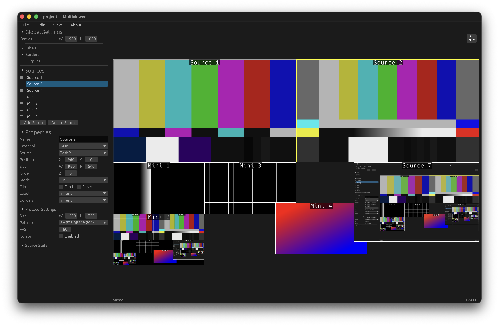

# Multiviewer

<div align="center">
	
	
	
	
  
</div>

> A hardware-accelerated, multi-protocol video multiviewer built in Rust. Drag, resize, and snap video sources on an interactive canvas with real-time compositing.

---

## Features

- **Multi-Protocol Video Sources** — ingest from many video protocols or test patterns.
- **Hardware-Accelerated Compositor** — wgpu-based pipeline with YUV→RGB conversion on the GPU, minimal CPU↔GPU copies.
- **Interactive Canvas** — drag, resize, snap, and zoom layers intuitively.
- **Per-Source Settings** — configure each source individually with persistent session state.
- **Real-Time Output** — broadcast the composed view.
- **Cross-Platform** — native desktop applications for macOS, Windows, and Linux.

---

## Supported Protocols

| Protocol | Source | Output | Platforms | Notes |
|----------|--------|--------|-----------|-------|
| **Test Patterns** | ✅ | — | macOS, Windows, Linux | SMPTE color bars and generative patterns |
| **NDI** | ✅ | ✅ | macOS, Windows, Linux |   |
| **Blackmagic DeckLink** | ✅ | ✅ | macOS, Windows, Linux | Requires [DeckLink Desktop Video](https://www.blackmagicdesign.com/support/family/capture-and-playback) installed |
| **Syphon** | ✅ | ✅ | macOS only | GPU-only, zero-copy texture sharing |
| **Spout** | ✅ | ✅ | Windows only | GPU-only, zero-copy texture sharing |
| **AVFoundation** | ✅ | — | macOS only | Webcams and capture devices |
| **MediaFoundation** | ✅ | — | Windows only | Webcams and capture devices |
| **macOS Screen Capture** | ✅ | — | macOS only | Display and window screen capture |

---

## Built Upon

Multiviewer is built with:

- **[Rust](https://www.rust-lang.org/)** (Edition 2024) — systems programming language with fearless concurrency
- **[egui](https://github.com/emilk/egui)** / **[eframe](https://github.com/emilk/egui/tree/master/crates/eframe)** — immediate-mode GUI toolkit
- **[wgpu](https://wgpu.rs/)** — safe, portable WebGPU implementation for GPU compute and rendering

---

## Installation

### Precompiled Binaries (Recommended)

Download ready-to-use binaries for macOS, Windows, and Linux from the [Releases page](https://gitlab.com/multiviewer/multiviewer/-/releases).

### Build from Source

```bash
git clone https://gitlab.com/multiviewer/multiviewer.git
cd multiviewer
cargo build --release
```

> **Note:** The NDI SDK must be installed on your system for NDI support. See [Setup environment](#setup-environment) below.

---

## Development

Using [go-task](https://taskfile.dev/)

### Setup environment

```bash
task setup
```

**Note:** This will download the NDI SDK to a local project directory which will be used during builds. You can also download and install the SDK system-wide from [NDI's website](https://ndi.video/download-ndi-sdk/)

`task setup` only sets up the repository. On Linux it also needs a C/C++ toolchain and libclang (`grafton-ndi` runs `bindgen`): run `task linux:setup:system-deps` once on Debian/Ubuntu, or install `build-essential clang libclang-dev` yourself. The resulting `.deb` declares its runtime libraries in `depends`, so they are installed with the package.

### Run the App

```bash
task run
```

### Build the App

```bash
task package
```

### Test

```bash
cargo test
```

---

## How It Works

Multiviewer ingests video from multiple protocols, composites them on a shared GPU canvas, and can broadcast the result back out over NDI, DeckLink, or Syphon.

1. **Source Threads** — each protocol runs on its own thread, decoding frames and handing them off to the main thread via lock-free `Arc` swaps.
2. **GPU Compositing** — a single WGSL shader handles passthrough (RGBA/BGRA) and UYVY→RGB conversion (BT.601 for SD, BT.709 for HD) directly on the GPU.
3. **Zero-Copy Paths** — Syphon sources feed GPU textures directly with no CPU copy; NDI and DeckLink use shared CPU buffers uploaded via `queue.write_texture()`.
4. **Interactive UI** — the egui canvas lets you arrange sources freely, with snap-to-grid, zoom, and per-layer controls.

---

## References & Specifications

- [NDI SDK](https://ndi.video/download-ndi-sdk/) — NDI, proprietary with attribution requirements
- [Blackmagic DeckLink SDK](https://www.blackmagicdesign.com/support) — BSD-style license (see header files)
- [Syphon](https://syphon.v002.info/) — BSD 3-clause
- [Spout](https://spout.zeal.co/) — BSD 2-clause

---

## Contributing

Contributions are welcome! Whether it's bug reports, feature requests, or code contributions:

1. Fork the repository
2. Create a feature branch
3. Commit your changes
4. Push to the branch
5. Open a Pull Request

---

## License

This project is licensed under the MIT License. See the [LICENSE](./LICENSE) file for details.

---

<div align="center">
  <strong>Made with ❤️ for live video production</strong>
</div>
